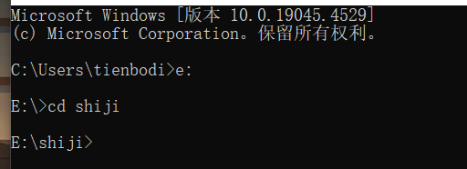
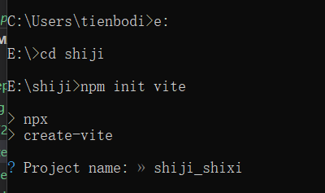
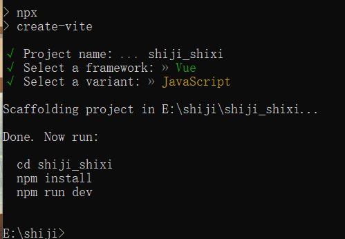

(vite创建vue2未导入相应的配置)  
---
1.选择相应的文件夹  

---
2.npm init vite，并且输入项目名称  

---
3.选择相应的配置 
```vue2是选择 vanilla，vue3是选择vue```

---
4.npm install是下载npm相应配置
npm run dev 是运行该vue文件
---
5.引入element-ui  
首先使用
```npm i element-ui -S ```使用 npm 的方式安装  
---
6.在mani.js里进行引入  
---
```import Vue from 'vue';
import ElementUI from 'element-ui';
import 'element-ui/lib/theme-chalk/index.css';
import App from './App.vue';

Vue.use(ElementUI);

new Vue({
  el: '#app',
  render: h => h(App)
});
```  
7.借助 babel-plugin-component，我们可以只引入需要的组件，以达到减小项目体积的目的.
首先，安装 babel-plugin-component：  
---
```npm install babel-plugin-component -D```
然后先在根目录添加一个.babelrc，在修改其文件
```{
  "presets": [["es2015", { "modules": false }]],
  "plugins": [
    [
      "component",
      {
        "libraryName": "element-ui",
        "styleLibraryName": "theme-chalk"
      }
    ]
  ]
}
```

vue-cli来搭建vue2
---
1.首先使用npm先下载vue，使用```vue -v```来查看是否安装成功  
2.在相应的文件夹输入```vue create 项目名称```  
3.或者使用```vue ui```来使用ui界面搭建vue2  
4.按上方相应顺序导入element-ui  
element-ui官方文档：[element-ui](https://element.eleme.cn/#/zh-CN/component/quickstart)
